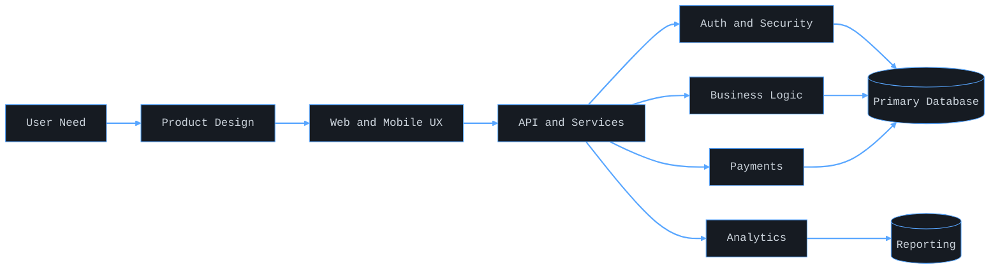

  <h1>こんにちは、ナナ です。</h1>
  <h3>フルスタック開発者 | Full-Stack Developer</h3>
  
<strong>創る。磨く。届ける。</strong>

  
<strong>速く作り、深く考え、価値を届ける。</strong>

  
<strong>挑戦を楽しみ、品質で信頼を築く。</strong>

  

  

    Character SVG is hosted in NanaBright/assets for profile-ready rendering.
  

  
  
  
  

  
  
  

<table>
  <tr>
    <td width="50%" valign="top">

### About Me

- Full-stack developer with 6+ years of shipping products.
- Building practical software for Ghanaian and African markets.
- Core stack: Next.js, React Native, Node.js, Laravel, Python, Rust.
- I optimize for speed, reliability and business impact.

    </td>
    <td width="50%" valign="top">

### Current Focus

- Private enterprise platform engineering.
- Private social analytics dashboard development.
- Production hardening for mobile and API systems.
- Better UX on conversion-critical user flows.
- All be ⚙️⚙️⚙️

    </td>
  </tr>
</table>

## Public Showcase

| Project | What It Delivers | Stack | Live |
| --- | --- | --- | --- |
| FlowStock v2 | Inventory and POS platform for SMB operations | Next.js, TypeScript, SQLite, Shadcn UI | https://flowstock-v2.vercel.app/ |
| FlowStock | Enterprise inventory backend and operations control | Laravel, MySQL, Node.js, Tailwind CSS | https://flowstock.lippty.com/ |
| TaxFlow Ghana | Tax automation for SMEs | Next.js, Express.js, PostgreSQL | https://tax-api-dashboard.vercel.app/ |
| WeatherWave | AI-enhanced weather app with PWA support | Next.js, TypeScript, OpenWeather API | https://weather-wave-chi.vercel.app/ |
| Eldo | Ethereum dApp for transfers with metadata | React, Solidity, Hardhat, Ethers.js | https://eldo-five.vercel.app/ |
| Lippty | Multi-vendor e-commerce marketplace | Laravel, Vue, MySQL | https://lippty.com/ |
| Slatetnd | Mobile-first Ghana business directory | Next.js, Tailwind CSS, Maps | https://slatetnd.vercel.app/ |
| TRYST | Event platform with interactive polling | Next.js, TypeScript, Node.js | https://tryst-psi.vercel.app/ |

## Open Source Work

  
  

  

  

## Stack Matrix

  
  
  
  
  

## Delivery Blueprint

## GitHub Pulse

  
  

  
  

## WakaTime Pulse

  

  

  WakaTime connected: @nb_Skerr

## Portfolio Snapshot

  
<strong>View project distribution (privacy-safe)</strong>

| Group | Count |
| --- | --- |
| Private Client Systems | 2 |
| Production Ready | 6 |
| Near Complete | 9 |
| Active Development | 8 |
| Needs Work | 2 |

## Contact

  <a href="mailto:nanabryte.nb@gmail.com">Email</a> |
  <a href="https://nb-me.vercel.app/">Portfolio</a> |
  <a href="https://github.com/NanaBright">GitHub</a> |
  <a href="https://twitter.com/n_skerr">X</a>

<strong>一緒にすごいものを作りましょう。</strong>

<strong>Open to collaboration on high-impact web, mobile, API and platform products.</strong>

